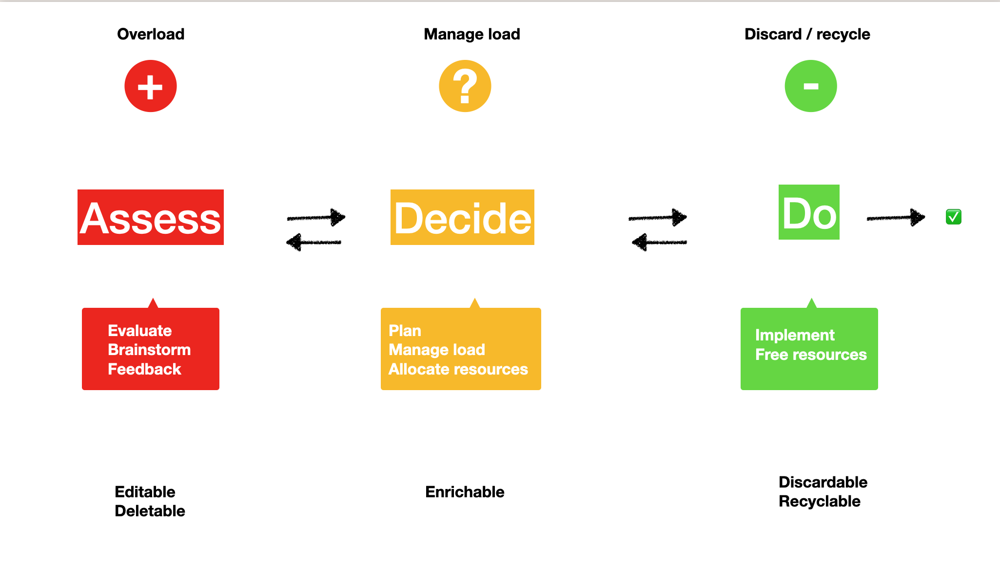
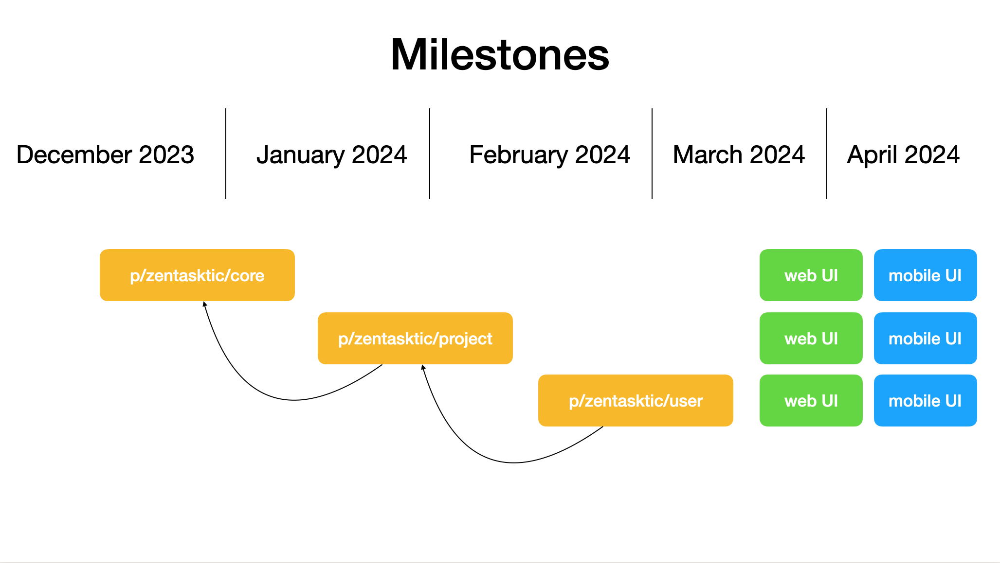

### Name - ZenTasktic
### Project name - ZenTasktic
### Team member GitHub handles 

https://github.com/irreverentsimplicity

### Links to Twitter, website - N/A
### ZenTasktic grant program
### Grant type: builder

### Description

ZenTasktic is an app implementing the "Assess-Decide-Do" (ADD) productivity framework. 
***

***

The ADD framework implies that we are spending time roughly in 3 main realms: Assess (creativity, evaluation, feedback, brainstorming), Decide (planning, resource allocation) and Do (implementation). An "atomic", clearly defined presence in each realm increases productivity, while lowering both friction and stress, and generates more predictable results. A significant overlappong across two or three realms generates imbalance, increases both frictions and stress, and consumes more energy.

ZenTasktic implements this framework by defining specific workflows and data types. Any task added in "Assess" overloads the system. Once the assessment is done, the task is moved into "Decide" where the system load is managed. The task can either be sent back to Assess (if there are no resources available, for instance), or resources gets allocated and the task is sent to "Do". In "Do", there are mo more operations applied to the task, it stays there until it's either sent back to "Decide" (if more resources are needed), or marked as "Done", which removes the overload on the system.

The data types are "editable / deletable" in "Assess" (that's the only place where the content of a task can be edited), "enrichable" in "Decide" (that's where resources like time or materials are added), and "discardable / recyclable" in "Do" (that's where a task is marked as "Done", and eliminated from the system or recycled back into "Decide" or "Assess").

The main benefits of the ADD framework are instant observability, fast diagnose and cumulative improvement.

For the Gno ecosystem, ZenTasktic will create a custom implementation, as follows:

- a basic, minimalisitc ADD implementations as `p/zentasktic/core` which will expose all the basic features of the framework: tasks & projects with complete workflows. Ideally, this should offer an easily forkable basis for any other custom implementation
- an opinionated, complete project management solution for the gno ecosystem as `p/zentasktic/project`. This implementation will enrich the data types with (but not limited to): teams (definable or not as DAOs), specific resources (work hours, custom rewards), OKRs (linkable or not with tasks / teams)
- at least one custom implementation as `p/zentasktic/todo` which can be used for self-management by an individual - this will include a minimal set of different data types than the ones defined in `p/zentasktic/project` and serve as an example for further extension of the core package

All 3 implementations will have a web / mobile (React / React Native) UI, which will include dashboards for quick health checks.

### What is the goal or the purpose of the proposed grant? 

The grant should support the implementation of `p/zentasktic/core`, `p/zentasktic/project` and `p/zentasktic/todo`, along with their respective React / React Native UIs.

### Contributions, issues and pull requests made to Gno and Game of Realms

@irreverent_simplicity is the recipient of the Flippando grant: [https://github.com/gnolang/ecosystem-fund-grants/pull/1](https://github.com/gnolang/ecosystem-fund-grants/pull/1).

PR on Gno for improving the current GRC71 implementation: [https://github.com/gnolang/gno/pull/1309](https://github.com/gnolang/gno/pull/1309)

### Why are you best suited/what is your background 

As a grant recipient, I already gathered experience and knowledge of the gno ecosystem. I'm also the creator of both [ZenTasktic](https://zentasktic.com) iOS / macOS app, and the Assess-Decide-Do framework.

### Milestones and overall time frame of your proposal

- `p/zentasktic/core` - end of January 2024
- `p/zentasktic/project` - end of February 2024
- `p/zentasktic/user` - end of March 2024
- frontends - end of April 2024

Given the nature of the project, and based on the feedback I will receive from staekholders, I accounted for any eventual refactors of the previous deliverable at each milestone.

### Your idea for fair funding of the proposal

I request $7200 / month, for the duration of the grant (4 months) - which all cover all the development costs. 

### What do you and the submission bring to the Gno.land platform and community?

The goals of this project are: 

- create a re-usable producivity framework that can be used by other apps or even competing or co-existing project management tools
- create an opinionated project management app that can be used by gno in the building process
- create a working example of a simple custom implementation, that can be used as a standalone personal productivity app, or as a starting point for extending it with extra functionality
- create web and mobile frontends for each of the above 

### Share any referrals or other projects you work with

[ZenTasktic](https://itunes.apple.com/app/apple-store/id1492487688?mt=8), iOS / macOS productivity app.