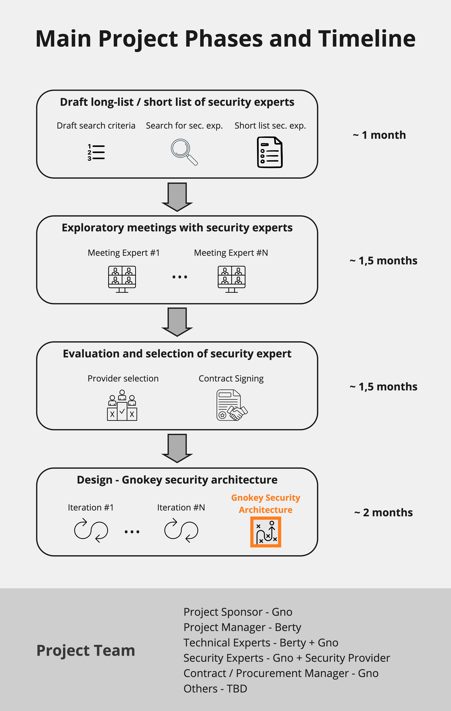

# Gno Grant#3 Gnokey Security Architecture

# Berty X Gno Grant #3 Application

- **Name:** Berty Technologies
- **Project name**: Gnokey Security Architecture
- **Organisation description:**
    - Berty Technologies is a French NGO with a mission to bring unstoppable and un-censorable communication tools to web3 application builders and the world. Our flagship product is **Wesh Network**, an open-source decentralized communication protocol designed to enable resilient communication even in off-the grid environments. **Berty Messenger** is a decentralized communication tool and the first mobile application that uses Wesh Network.
    - We already completed a successful Gno Grant and have built **Gno Native Kit** - repo here [https://github.com/gnolang/gnonative](https://github.com/gnolang/gnonative). We are also in the process of delivering a second Gno Grant to build **Gnosocial** - repo here [https://github.com/gnolang/gnosocial](https://github.com/gnolang/gnosocial).
- **Team member GitHub handles**: jefft0, d4ryl00, iuricmp, costinberty
- **Links to Twitter, website:**
    - [https://berty.tech/](https://berty.tech/)
    - [https://wesh.network/](https://wesh.network/)
- **The title of your grant submission:**
    - Gnokey Security Architecture
- **Grant type:** Researcher
- **A short description of what you are proposing:**
    - This is a grant application to design the security architecture for Gnokey. In a nutshell, the Gnokey application will be a mobile application that users will use to *securely* manage their keys and sign their (D)app transactions. One of the main benefits is that (D)apps builders will not have to worry about building in their apps the security part and they could just “outsource” it to the Gnokey app and remain focused on building their app’s main functionalities.
    - To build Gnokey we, at Berty, are proposing a 3 step approach:
        - Step 1: identify main features of Gnokey as well as a high-level architecture or system diagram - DONE
        - **Step 2:** work with Gno team to identify a 3rd party security expert that can help detail the technical architecture so we make sure that Gnokey is secure and that users can trust it. **This is actually the objective of this Grant proposal: to obtain a technical implementation plan for Gnokey**; plan that we can implement later.
        - Step 3: building on the technical implementation plan from Step 2 (Gnokey Grant) decide who is best positioned to build the app. I[t](http://app.It) could be the Berty team, Gno or someone else.
- **What is the goal or the purpose of the proposed grant?**
    - The goal of this grant is to obtain a detailed security architecture or a technical plan for building the Gnokey app. The plan has to be designed or at least validated by a 3rd party security expert.
    - Once we reach this goal, Step 2 from above will be completed and we will be able to move on to actually building the Gnokey app (Step 3).
- **Contributions, issues and pull requests made to Gno and Game of Realms** (links please)
    - **Blogpost** “[GnoMobile, a Framework for Building Gno Mobile Apps](https://test3.gno.land/r/gnoland/blog:p/gnomobile)”
    - [PR1034](https://github.com/gnolang/gno/pull/1034) Fix demo/boards/README, fix typos and change to a local node
    - [Issue 1031](https://github.com/gnolang/gno/issues/1031)Some READMEs refer to an old version of the quickstart guide
    - [PR1213](https://github.com/gnolang/gno/pull/1213) In Amino, use ToLowerSnakeCase for Protobuf field names
    - [PR1235](https://github.com/gnolang/gno/pull/1235) In amino.pkg, add optional WithComments, use them in GenerateProto3MessagePartial
    - [PR1289](https://github.com/gnolang/gno/pull/1289) fix: Error string in decryptPrivKey. Use errors.As in IsErrWrongPassword
    - [PR1031](https://github.com/gnolang/gno/pull/1301) fix: In TestGnoDoc, fix expected output for "doc", "avl". (Mentioned by [https://github.com/gnolang/gno/pull/1306](https://github.com/gnolang/gno/pull/1306) )
    - [PR1313](https://github.com/gnolang/gno/pull/1313) Add Keybase HasByNameOrAddress, HasByName and HasByAddress
    - [PR1316](https://github.com/gnolang/gno/pull/1316) fix: In Keybase GetByAddress, change generic error to NewErrKeyNotFound
    - [Issue 1070](https://github.com/gnolang/gno/issues/1070) "Gas used" is different than number of coins subtracted. (Mentioned by [https://github.com/gnolang/gno/issues/1067](https://github.com/gnolang/gno/issues/1067) and [https://github.com/gnolang/gno/issues/1106](https://github.com/gnolang/gno/issues/1106) )
    - Thanks to the Gno Native Kit (old name Gnomobile) and to the Gnosocial grants, we made a number of contributions to the Gno repos. We usually describe these contributions in our “journey” issues. [Here is a link](https://github.com/gnolang/hackerspace/issues/51) for our latest Gnosocial journey where a significant number of contributions (PRs but not only) are listed and explained.
- **Why is your team best suited for this project and what is your background?**
    - We have already significant experience with Gnolang:
        - Thanks to a Gno Grant we have already build the **Gno Native Kit** framework that can be used by builders to build and port gno.land (D)apps written in their app's *****native* programming language.
        - We are also building the **Gnosocial** experimental (D)app. So we have significant experience with both designing dev tools and (D)app building. We have already relevant e
    - We bring to the table both the builder perspective and the technical enabler one. We are naturally positioned to contribute to the design of Gnokey and we have a history of successful collaborations with the Gno team.
- **Milestones and overall time frame of your proposal**
    - **Timeline**: we see 4 main project phases to obtain the technical security plan (objective of this grant):
        1. Obtain a short of security experts - look in the market for a list of security experts (organisations) that could help us obtain the security plan.
            - Estimate duration: ~1 month
        2. Exploratory meetings - Conduct a series of talks with the shortlisted security experts to make sure we they understand our needs as clients and that we get a more complete understanding of their services.
            - Estimate duration: ~1.5 months
        3. Evaluation and Selection - choose the preferred security provider and reach an agreement (sign a contract). Since the contract will be signed between the Gno team and the Security Provider, we will need the support of a contracts manager (or equivalent role) from AiB.
            - Estimate duration: ~1.5 months
        4. Design the Gnokey Security Architecture - work with the security provider, most likely in iterations, to design the the security architecture of Gnokey.
            - Estimate duration: ~2 months
        
        The total estimate time is approximately 6 months. However, this being mostly a research project with a significant number of unknowns, the duration may extend if we hit difficult obstacles. 
        
    - **Project team proposition**: this initiative will require a **mixed project team** from Berty, Gno and the selected Security Provider organisation. We see the following team composition:
        - Project Manager from Berty (Costin)
        - Technical Experts from both Berty (Remi, Jeff, Iuri) and Gno teams (to be identified)
        - Security Expert from Gno team (Kristof)
        - Contract Manager from Gno team for the formalisation of the agreement with the Security Expert organisation (to be identified)
        - Security Expert Provider (to be selected)
        
        The project team members will not need to be 100% dedicated to this project as we expert the work to be done mostly in spikes. Meetings time will be kept to a minimum and we will do the maximum of async communication.
        
    
    
    
    - A description of the proposed general approach for Gnokey is [here](https://www.loom.com/share/27b0aaf07d2c4141bbf753efa5b2e189)
    - A more detailed overview of the technical challenge can be found [here](https://miro.com/app/board/uXjVN3d9Pts=/?playRecording=3439faf7-4413-4ebb-9d36-51aac2be588b) (the link works only on desktop and will open a video embedded in a Miro board)
- **Your idea for fair funding of the proposal**
    - We estimate that for the Berty team this grant research project will require the equivalent of 1 month of work. So, we are asking for a 60.000 € funding, representing a full month of our operational expenses.
    - ⚠️ Observation: the Gnokey grant may impact the timeline of our existing Gnosocial grant and may cause a delay for the later of approximately 1 - 1.5 months.
- **What do you and the submission bring to the Gno.land platform and community?**
    - In support of builders, Gnokey will take care of all the security around keys and transaction management. So developers will be able to focus on building their apps, while having the peace of mind that the security is taken care of by Gnokey.
    - We have already made the first steps for building Gnokey and now we need Gno’s help and funding to complete the security design of the tool.
